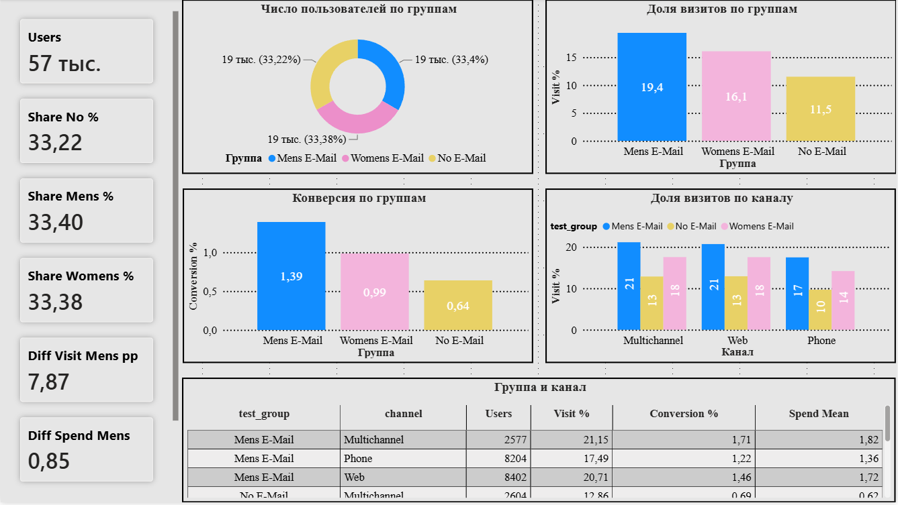

# EmailAnalytics A/B/C Testing - email Mens / Womens / No Email

Пет-проект: эксперимент A/B/C от CSV до дашборда.  
Датасет: [Kevin Hillstrom MineThatData E-Mail Analytics](https://www.kaggle.com/datasets/bofulee/kevin-hillstrom-minethatdata-e-mailanalytics)

64 000 клиентов. Рандом 1/3 : 1/3 : 1/3:
- **No E-Mail** - control (письмо не слали)
- **Mens E-Mail** - письмо с мужским ассортиментом
- **Womens E-Mail** - письмо с женским ассортиментом

Дальше 2 недели смотрели: зашёл ли (`visit`), купил ли (`conversion`), сколько $ (`spend`).

Python -> MySQL -> Power BI. Метрики сверены между слоями.

---

## Вердикт теста

**Катим Mens E-Mail** - письмо лучше No E-Mail и сильнее Womens.

- Без письма на сайт зашли **11.52%**, после Mens **19.39%** (+7.87 pp), после Womens **16.08%** (+4.56 pp).
- Покупки: No **0.64%**, Mens **1.39%** (+0.75 pp), Womens **0.99%** (+0.35 pp).
- Средний spend: No **0.73**, Mens **1.58** (+0.85), Womens **1.20** (+0.47).
- Тест уверенный: по visit/conversion/spend у Mens плюс значимый.
- Сплит после чистки 33.2% / 33.4% / 33.4%, SRM ок (chi2 0.333, p 0.8466).

**!!!** смотрим `visit` как основную, conversion и spend рядом.  
`channel` / `zip_code` / `newbie` / `mens`/`womens` - срезы, не руки. В report: channel и zip.

---

## О чём проект

| Слой | Что делает |
|------|------------|
| **Python** | ETL, parquet, SRM 3 руки, z-test (visit/conversion) + Welch (spend) |
| **SQL (MySQL)** | схема, sanity, KPI n / rate / mean / diff + срезы |
| **Power BI** | Overview (сплит, визиты, конверсия, channel) |

**Маршрут: sanity -> SRM -> A/B/C попарно vs No Email -> spend -> срезы -> вердикт**
- **sanity** - full-dup, доли `group`
- **A/B/C** - `visit` / `conversion`: n, rate, diff pp, z-test, CI
- **spend** - mean, Welch, CI
- **срез** - `channel`, `zip_code` (не группа!); в PBI - channel

**Зерно:** 1 строка = 1 клиент (id в файле нет).

---

## Данные и ETL

Исходник: **64 000** строк. После clean: **57 438** (отвал **6 562** full-dup).

**Чистка:** drop_duplicates, `segment` -> `group`, типы 0/1 и spend.

**Сплит** No / Mens / Womens 33.2% / 33.4% / 33.4% (план 1:1:1).

| Колонка | Смысл |
|---------|--------|
| `recency` / `history` / `history_segment` | профиль до теста |
| `mens` / `womens` / `newbie` | что покупал / новичок (срезы) |
| `zip_code` | Urban / Surburban / Rural (срез; опечатка в данных) |
| `channel` | Web / Phone / Multichannel (срез) |
| `segment` -> `group` | рука теста |
| `visit` / `conversion` / `spend` | исходы за 2 недели |

---

## Ключевые цифры

| Метрика | No E-Mail | Mens E-Mail | Womens E-Mail |
|---------|-----------|-------------|---------------|
| n | 19 081 (33.2%) | 19 183 (33.4%) | 19 174 (33.4%) |
| visit | 11.52% | 19.39% (+7.87 pp) | 16.08% (+4.56 pp) |
| conversion | 0.64% | 1.39% (+0.75 pp) | 0.99% (+0.35 pp) |
| spend mean | 0.73 | 1.58 (+0.85) | 1.20 (+0.47) |

SRM vs 1/3 : 1/3 : 1/3: chi2 0.333, p 0.8466.

Цифры совпадают в `scripts/report.py`, SQL (`04`-`06`) и карточках Power BI.

---

## Дашборд

Готовый отчёт: [`powerbi/Email_ABC_Dashboard.pbix`](powerbi/Email_ABC_Dashboard.pbix)

| Файл | Что |
|------|-----|
| `powerbi/screenshots/01_overview.png` | одна страница: сплит + визиты + конверсия + channel |

### Overview


- карточки: Users, Share No/Mens/Womens %, Diff Visit Mens, Diff Spend Mens
- бублик: число пользователей по группам
- столбцы: доля визитов по группам
- столбцы: конверсия по группам
- столбцы: доля визитов по каналу (легенда = группа)
- таблица: группа x канал (Users, Visit %, Conversion %, Spend Mean)

---

## Pipeline

| Файл | Назначение |
|------|------------|
| `scripts/pipline.py` | load, типы, drop dup, SRM, parquet |
| `scripts/report.py` | z-test visit/conversion, Welch spend, channel/zip, вердикт |
| `scripts/load_mysql.py` | parquet -> MySQL |
| `sql/01`-`03` | схема, sanity, keys |
| `sql/04`-`06` | totals, by group, diff + channel/zip |

---

## Power BI - модель

Одна таблица `clean_users` (Import). Связей нет. `group` в MySQL = `test_group`.

```dax
Users = COUNTROWS ( 'clean_users' )
Users No = CALCULATE ( [Users], 'clean_users'[test_group] = "No E-Mail" )
Users Mens = CALCULATE ( [Users], 'clean_users'[test_group] = "Mens E-Mail" )
Users Womens = CALCULATE ( [Users], 'clean_users'[test_group] = "Womens E-Mail" )

Share No % = DIVIDE ( [Users No], [Users] ) * 100
Share Mens % = DIVIDE ( [Users Mens], [Users] ) * 100
Share Womens % = DIVIDE ( [Users Womens], [Users] ) * 100

Visit % = AVERAGE ( 'clean_users'[visit] ) * 100
Visit No % = CALCULATE ( [Visit %], 'clean_users'[test_group] = "No E-Mail" )
Visit Mens % = CALCULATE ( [Visit %], 'clean_users'[test_group] = "Mens E-Mail" )
Diff Visit Mens pp = [Visit Mens %] - [Visit No %]

Conversion % = AVERAGE ( 'clean_users'[conversion] ) * 100

Spend Mean = AVERAGE ( 'clean_users'[spend] )
Spend No = CALCULATE ( [Spend Mean], 'clean_users'[test_group] = "No E-Mail" )
Spend Mens = CALCULATE ( [Spend Mean], 'clean_users'[test_group] = "Mens E-Mail" )
Diff Spend Mens = [Spend Mens] - [Spend No]
```

---

## Стек

Python (pandas, pyarrow, scipy) -> MySQL 8 -> Power BI Desktop (DAX).

---

## Автор

@cat_main
